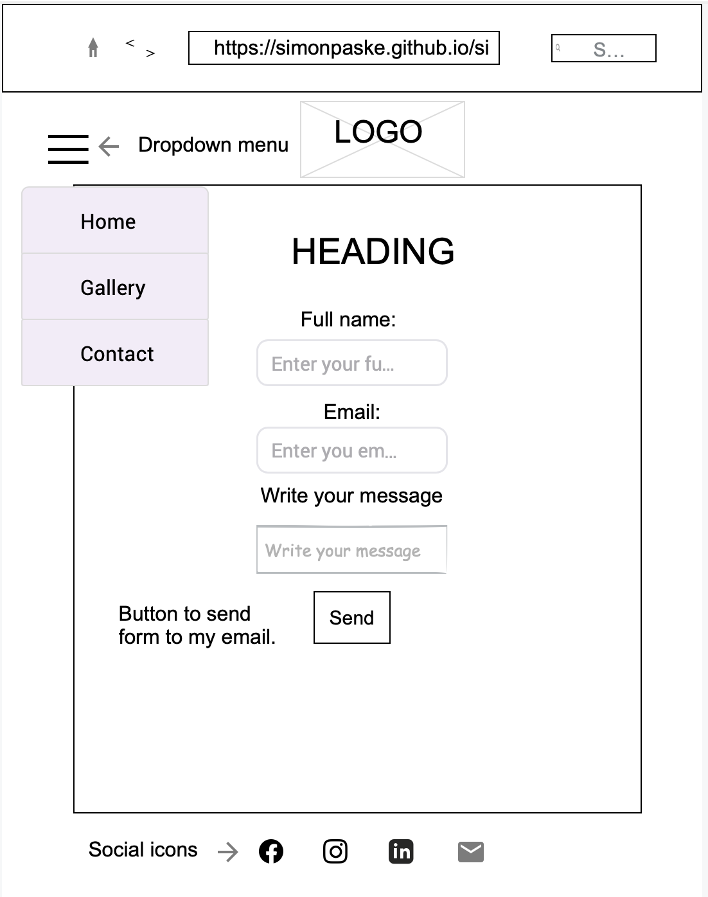
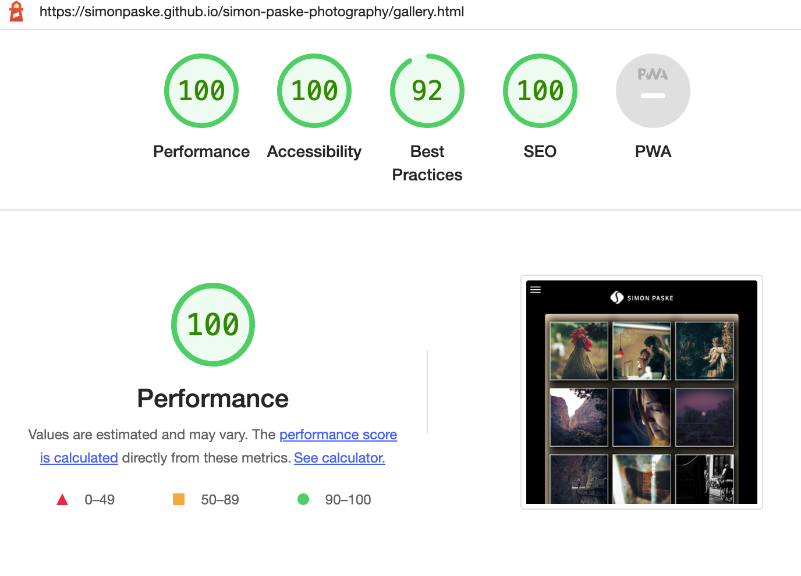
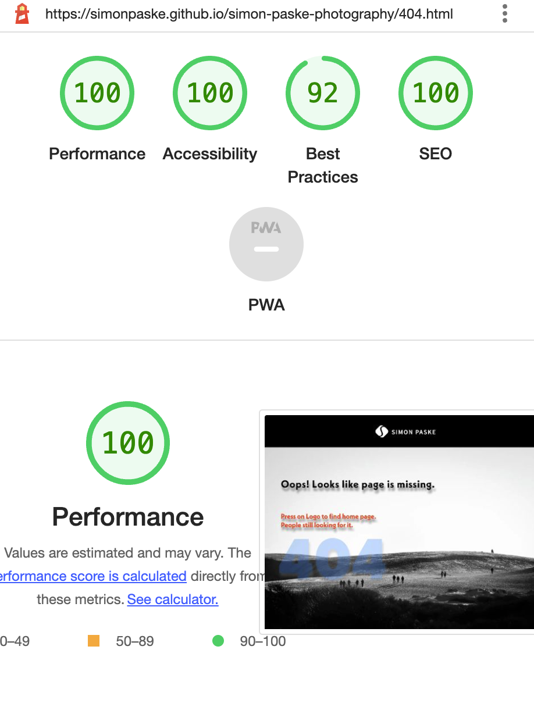

# Simon Paske photography

Simon Paske photography is a website that allows users to read a short story about my photography path and earned achievements. Moreover, a user is getting a better understanding of what kind of person I am as a human being and what photography means to me. The web page also provides a small collection of various genre images and short presentational videos with my works.

You can visit the live website --> [here](https://simonpaske.github.io/simon-paske-photography/)

---

### Sitewide

* Dropdown Navigation Menu
   * Contains links to the Home, Gallery and Contact pages. It will be responsive on all devices.
   * It will allow a user to easily use and navigate through the website on any device.

---

* Footer
   * The Footer contains Social Media icons as links to desired platforms.
   * Icons contain aria labels, therefore visually impaired people can reach me by use of a screen reader.

---

* Favicon
  * Favicon with my logo is visible throughout the website pages.
  * It will help users faster and easier find my pages if many tabs in a browser are opened.

    

---

* 404 Page
   * The page will be displayed if a user navigates to a broken link.
   * 404 page allows users to reach out easily via Facebook or email. Moreover, by clicking on the logo people will be redirected to the home page without the need of clicking the back button on an internet browser.

    

---

* Read more / Show less
  * This gives users an option to spread and shrink text on a home page.

---

* Embedded Video
   * This allows users to visit my Youtube channel and see more of my videos. Furthermore, users can adjust video quality depending on their internet connection.

---

* Lightbox
   * This gives users a great possibility to see a large image on a screen. In addition, customers can see the next or previous photograph without exiting the lightbox.

---

### Landing Page

* Landing page image
   * It includes a hero image in which I was photographed as a child with a camera in my hands.
   * A text below the hero image tells that website content will be related to the photography.

---

* Read more
   * This short portion of text gives the possibility for users to read more about my photography journey, achievements and companies that I worked with.
   * The story shows that I love my work, I gained the trust of worldwide companies and deliver professional services.

---

### Gallery Page

* The gallery gives the possibility to users see my works of different scenarios and genres. The page is working fully responsive on any device.
  * For the moment gallery contains 12 photographs that can be enlarged.
* The Lightbox feature ensures that users can see their favorite images in a bigger size.

---

### Contact Page

* Contact form lets customers fill out the form and leave a message regarding the question. The form consists of the following fields and attributes:
   * Full Name (required, type=text)
   * Email (required, type=email)
   * Write your message here (required, type=textarea)
* After successful form submission, the customer will get a confirmation message and the possibility to go back to the contact.html page.
 * This gives the possibility for the customer to contact me if they want to get the price for my services or any other information.

---

### Appealing Feature

* Responsive design
* Hidden navigation menu, which gives more attention to the content
* Responsive Lightbox design independent of device orientation
* Contact form with a confirmation about the successful form
* The submitted form sends a submission straight to my email
* Animated social icons
* Embedded video from Youtube with the option to adjust the quality

---

### Feature Left to implement

* As a future improvement:
   * The photos could provide EXIF information for other photographers. An EXIF file is a form of data storage that provides specific information about photographs, like the camera settings, time and date, and location where a photo was taken.
   * Google maps would be implemented to show photo locations
   * Lightbox would be improved and responsive with an option to swipe and pinch gestures
   * Add a booking system

---

   

## Design

### Wireframes

---

Home page

 

---

  

Gallery

 

---

  

Contact

 

---

  

Contact form successful submission

 

---

  

404 Page

 

---

  

## Technologies

* HTML
  * The Website structure was developed using HTML as the main language
* CSS
  * For Website styling was used CSS in an external file
* Visual Studio Code
  * The website was developed using Visual Studio Code Desktop version using SSH key
* GitHub
  * Source code is hosted on GitHub and deployed using Git Pages
* Git Easy (extension for Visual Studio Code)
  * Was used to commit and push the code during the development process.
* Visual Studio Code Remote - SSH (extension for Visual Studio Code)
  * Was used to safely connect to the code stored on GitHub
* Git Graph (extension for Visual Studio Code)
  * Was used to follow the history of commits and correction comparison
* HTML Preview (extension for Visual Studio Code)
  * Was used to preview HTML files while editing them in VSCode
* Prettier - Code formatter
  * Was used to format code and keep it consistent
* W3C Web Validator (extension for Visual Studio Code)
  * Was used to check if any issues are detected and correct them
* Favicon.io
  * Favicon files were created at the favicon [converter](https://favicon.io/favicon-converter/)
* Adobe Photoshop
  * Was used to convert photos to low-size images
* Justinmind
  * Was used to create wireframes
* Ionicons
  * Was used to make the website more attractive
* Adobe Fonts
  * Was used to keep text styling consistent
* Formspree.io
  * Was used to receiving submissions to my email.

---

  

## Testing

### Responsiveness

---

All pages were tested to ensure responsiveness for screens from 300px up to 5000px. Responsive design was tested on Safari, Chrome and Firefox internet browsers.

Steps for testing:

1. Open the browser and enter the website [address](https://simonpaske.github.io/simon-paske-photography/)
2. Open developer tools by clicking the right button on the mouse or choosing the internet browser navigation bar.
3. Safari and Firefox browsers choose device type and size to see responsiveness. At Chrome internet browser by changing window size.

Expected:

No overlapping.
No strecthed or pixelated images.

Actual:
The website behaves as expected except on the 404.html page at landscape orientation on smaller devices. (Details can be found in the Unifixed bugs part of the documentation).

 

**The website was tested on these devices:**

Samsung S9

Samsung S22 Ultra

Samsung Note 9

Samsung S10

iPhone SE

  

---

### Accessibility

For the final testing, I used [WAVE tool](https://wave.webaim.org/) to check aid accessibility.

Testing was focused to meet the following criteria:

* All images and non-text elements have aria-labels and alt text and it is implemented correctly
* Pages meet contrast levels

---

### Issues 

1. The contact form did not have enough contrast
2. Headings are missing or are in the incorrect order

### Fixing the issues

1. Change the background of the contact form
2. Change headings' sizes to meet sequential order

---

  

### Lighthouse testing

**Navigation menu links**

Testing was performed for all HTML pages independently. This was done by entering the following HTML addresses into the address line on the browser.

| Navigation menu link | Page to Load |
| -------------------- | ------------ |
| Home                 | index.html   |
| Contact              | contact.html |
| Gallery              | gallery.html |
| 404                  | 404.html     |

All links were correctly connected to the desired labeling in the Navigation menu list.

  

 

---

**Contact form testing**

The form was tested to make sure that it is fully functional and that all submissions will be received to my email.

Steps to test:

1. Navigate to [Contact page](https://simonpaske.github.io/simon-paske-photography/contact.html). 2. Enter the following data:
    - Full Name: Simon Paske
    - Email: simas.paskevicius@gmail.com
    - Message: Test Test Test
3. Click on Send button to submit the form
4. The user is redirected to the submission confirmation and "Thank you" page.

Expected:

Unfilled fields were showing error messages with a suggestion to enter information. By filling in all the necessary fields in the form, it submits without warnings and the user is redirected to the submission confirmation and a thanks page.

Actual:

The submission worked as expected.

 

---

**Social Icons in the Footer**

Testing was performed on Ionicons by clicking and hovering on each icon to ensure that all links are working, opened in the new tab and has animation on the hovered social icon.

 
Expected:

Social icons' links open in a new browser tab. The email icon opens a default email application on the device with ready to send window to the targeted email address.

 
Actual:

Everything works as expected.

 

---

**Gallery testing**

Testing was performed by hovering the mouse pointer on the images and clicking on the photos. 

The lightbox buttons were tested by clicking on each button in random order.

 
Expected:

By hovering the mouse pointer on the photo, the image becomes a little bit bigger. 
Clicking on the photograph opens the lightbox with arrows for the next/previous image and a close button.

 
Actual:

Everything works as expected.

 

---

### Validator testing

 

**HTML**
  
  no errors were returned when running via the official [W3C validator](https://validator.w3.org)
  
 

 

**CSS**

no errors were returned when running via the official [W3C Jigsaw validator](https://jigsaw.w3.org)

 

---

### Unfixed Bugs

Responsiveness worked for all the websites on all devices with an exception for smaller screen devices at 404.html landscape orientation. I was unable to resolve this issue with my wishful design.

 

---

## Deployment

### Version Control

 

The site was created using Visual Studio Code (Desktop version). Code was pushed to Github to the remote repository "simon-paske-photography".

Git commands were used via Git Easy (an extension for Visual Studio Code).

 

---

### Deployment to Github Pages

The website was deployed to Github pages following these steps:

1. In the GitHub repository, click on the Settings icon
 

2. On the menu on the left side select "Pages"

3. In the "Build and deployment" section select Source "Deplay from a branch".

4. In the Branch section, select the "main" and "root" folders. 
5. Click Save.

 

The live site link will be displayed at the top of the GitHub Pages section in a blue color. 

 

---

## Credits

 

* Part of the code was used for Footer Social Icons and animation. 
  * **@alvarotrigo** (https://codepen.io/alvarotrigo/pen/GRxxWdQ).

 

* Part of the code was used to create a dropdown navigation button. 
  * **W3SCHOOLS** (https://www.w3schools.com/howto/howto_css_dropdown.asp)

 

* Inspiration for buttons in a lightbox 
  * **Treehouse Community** (https://teamtreehouse.com/community/adding-a-next-button-to-simple-lightbox)

 

* Inspiration for the "Read more / Show less" option
  * **EnmaScript** (https://enmascript.com/articles/2019/09/26/toggle-content-on-click-without-javascript)

* Inspiration and part of the code were used to create a lightbox for the gallery
  * **Markus Oberlehner**
  **@maoberleher** (https://perfundo.oberlehner.net/#perfundo-untarget)

---

 

## Media

All photographs are copyrighted and belong to:

 Simon Paske ©
