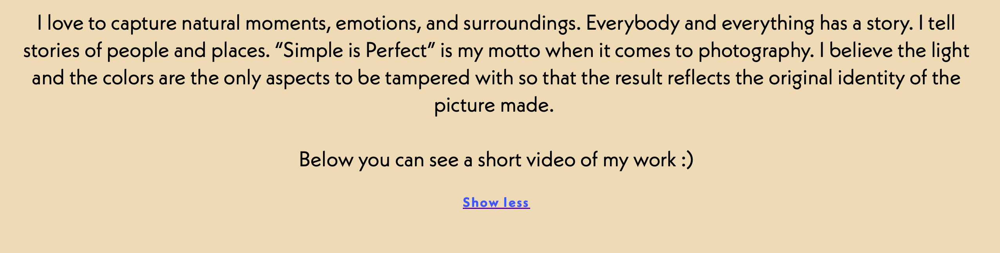
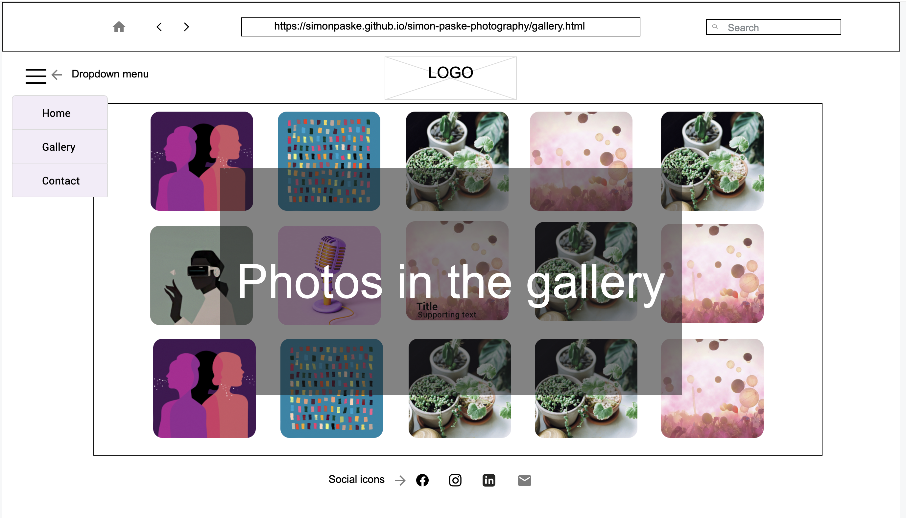
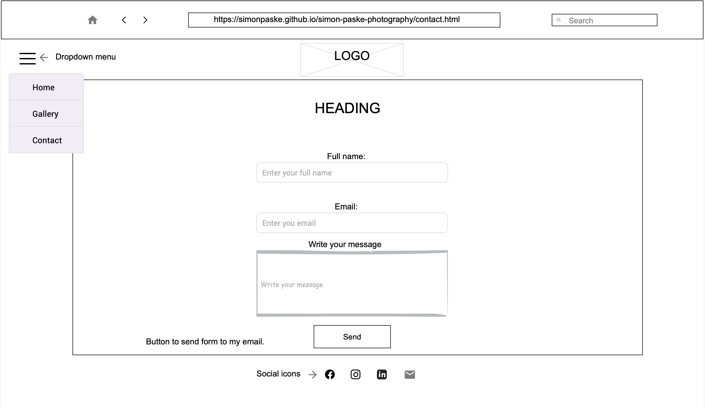

# Simon Paske photography

Simon Paske photography is a website that allows user to read a short story about my photography path and earned achievements. Moreover, user is getting a better understanding what kind of person I am as a human being and what photography means to me. The web page also provides a small collection of various genre images and short presentational video with my works. 

You can visit live website --> [here](https://simonpaske.github.io/simon-paske-photography/)

---
### Sitewide
* Dropdown Navigation Menu
    * Contains links to Home, Gallery and Contact pages. It will be responsive on all devices.
    * It will gives user an opportunity to easily use and navigate throught the website on any device.

---
* Footer
    * Footer contains Social Media icons as a links to desired platforms. 
    * Icons contains aria labels, therefore visually impaired people are able to reach me out by use of screen reader.

---
* Favicon
    * Favicon with my logo is visible throughout the website pages.
    * It will help to user faster and easier find my pages if many tabs in a browser are opened.

    

---
* 404 Page
    * Page will be displayed if user navigates to a broken link.
    * 404 page allows user to reach me out easy via Facebook or email. Moreover, by clicking on the logo people will be redirected to home page without need of clicking back button on internet browser.

    

---
* Read more / Show less
    * This gives users an option to spread and shrink a text on a home page.

---
* Embeded Video
    * This gives users an opportunity to visit my Youtube channel and see more of my videos. Furthermore, user can adjust video quality depending on its internet connection.

---
* Lightbox
    * This gives users a great posibility to see a large image on screen. In addition, customer can see next or previous photograph whithout exiting lightbox.

---
### Landing Page
* Landing page image
    * It includes hero image in which I was photographed as a child with camera in my hands. 
    * A text bellow the hero image obviously tells that website content will be related to the photography.

---
* Read more
    * This short portion of text gives possibility for users to read more about my photography journey, achievements and companies that I worked with.
    * The story shows that I really love my work, I gained trust from worldwide companies and deliver professional services.

    

---
### Gallery Page
* The gallery gives possibility to user see my works of different scenarios and genre. The page is working fully responsive on eny device.
    * For the moment gallery contains 12 pgotographs that can be enlarged.
* Lightbox feature ensure that user can see favorite images in bigger size.

---
### Contact Page
* Contact form lets customers to fill the form and leave a message regarding the question. The form consists of following fields and attributes:
    * Full Name (required, type=text)
    * Email (required, type=email)
    * Write your message here (required, type=textarea)
* After succsessful form submition the customer will get confirmation message and possibility to go back to contact.html page.
    * This gives posibility for the customer to contact me if they want to get the price for my services or any other information.

---
### Apealing Feature
* Responsive design
* Hidden navigation menu, which gives more attention to the content
* Responsive Lightbox design independent of device orientation
* Contact form with a confirmation about successful form
* Animated social icons
* Embeded video from Youtube with option to adjust the quality

---

### Feature Left to implement
* As a future improvement:
    * The photos could provide EXIF information for other photographers
    * Google maps would be implemented to show photo locations
    * Lightbox would be improved and responsive with an option to swipe and pinch gestures
    * Implement booking system
    
---
   

## Design

### Wireframes
---
Home page
 

---
  
Gallery
 

---
  
Contact
 

---
  
Contact form successful submition
 

---
  
404 Page
 

---
  
## Technologies

* HTML
    * The Website structure was developed using HTML as the main language
* CSS
    * For Website styling was used CSS in an external file
* Visual Studio Code
    * The website was developed using Visual Studio Code Desktop version using SSH key
* GitHub 
    * Source code is hosted on GitHub and deployed using Git Pages
* Git Easy (extension for Visual Studio Code)
    * Was used to commit and push the code during the development process.
* Visual Studio Code Remote - SSH (extension for Visual Studio Code)
    * Was used to safely connect to the code stored on GitHub
* Git Graph (extension for Visual Studio Code)
    * Was used to follow the history of commits and correction comparison
* HTML Preview (extension for Visual Studio Code)
    * Was used to preview HTML files while editing them in VSCode
* Prettier - Code formatter
    * Was used to format code and keep it consitant
* W3C Web Validator (extension for Visual Studio Code)
    * Was used to check if any issue is detected and correct them
* Favicon.io
    * Favicon files were created at https://favicon.io/favicon-converter/
* Adobe Photoshop
    * Was used to convert photos to low size images
* Justinmind
    * Was used to create wireframes

---
  

## Testing

### Responsivnes

---
All pages were tested to ensure responsivnes for screen sized from 300px up to 5000px. Responsive design was tested on Safari, Chrome and Firefox internet browsers.

Steps for testing:

1. Open browser and enter wbsite address https://simonpaske.github.io/simon-paske-photography/
2. Open developer tools by clicking right button on the mouse or choosing at the internet browser navigation bar.
3. At Safari and Firefox browsers choosing device type and size to see a responsivnes. At Chrome internet browser by changing window size.

Expected: 

No overlaping.
No strecthed or pixelated images.

Actual:
The website bahave as expected except on 404.html page at landscape orentation smaller devices. (Details can be found in Unifixed bugs part of documentation).

Website was tested on these devices:

Samsung S9
Samsung S22 Ultra
Samsung Note 9
Samsung S10
IPhone SE

  
---

### Accessibility

For the final testing I used WAVE tool (https://wave.webaim.org/) to check aid accessibility.

Testing was focus to meet following criterias:
• All images and non-text elements has aria-labels and alt text that is implemented correctly.
* 

